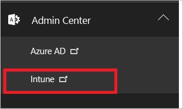
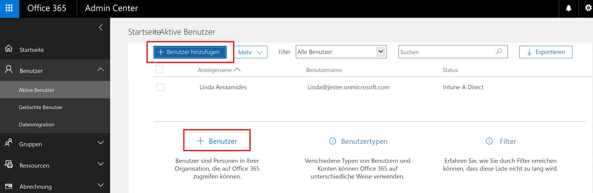
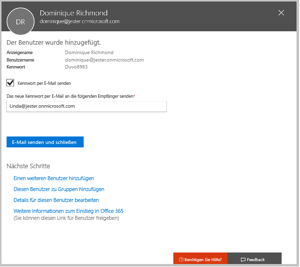
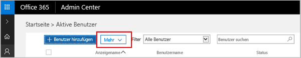

# Registrieren für eine kostenlose Testversion von Microsoft Intune
Dieser Artikel führt Sie durch die Registrierung für eine Testversion von Intune und zeigt, wie Sie diese vorbereiten, indem Sie einige Benutzer anlegen, damit Sie anschließend den Anleitungen im zugehörigen Evaluierungshandbuch folgen und verstehen können, wie mobile Geräte von Intune verwaltet werden. <!---or app data when devices are not enrolled in Intune.--->

## Annahmen
In diesem Artikel über die Registrierung und im Evaluierungshandbuch wird davon ausgegangen, dass Sie die Testversion nur zu Evaluierungszwecken verwenden und beim Abschluss des Abonnements mit einer sauberen Umgebung starten möchten.

Um Ihnen den Einstieg in die Testversion zu erleichtern, richten wir eine sehr einfache Umgebung ein, in der nur Intune verwendet wird. Außerdem wird davon ausgegangen, dass Intune die einzige Methode zur Verwaltung von Geräten ist (auch als Autorität für die Verwaltung mobiler Geräte oder MDM-Autorität bezeichnet). Allerdings finden Sie im gesamten Handbuch Verweise auf weitergehende technische Inhalte, wenn Sie ein Thema genauer untersuchen möchten.

In der Testversion stehen alle Funktionen zur Verfügung, die Sie auch in einer Abonnementversion ausführen können. Der einzige Unterschied besteht darin, dass die Testversion auf 100 Benutzerkonten beschränkt ist.

## Für die Testversion anmelden
Besuchen Sie die [Intune-Anmeldeseite](https://portal.office.com/Signup/Signup.aspx?OfferId=40BE278A-DFD1-470a-9EF7-9F2596EA7FF9&dl=INTUNE_A&ali=1#0%20), und füllen Sie das Formular zur Anmeldung für ein Testabonnement aus.

Wenn Sie über Geschäfts-, Schul- oder Unikonto verfügen und dieses für Ihre Intune-Testversion verwenden möchten, folgen Sie stattdessen [diesen Anmeldeanweisungen](https://docs.microsoft.com/en-us/intune/get-started/start-with-a-paid-subscription-to-microsoft-intune-step-1). In diesem Artikel und den Evaluierungshandbüchern wird jedoch davon ausgegangen, dass Sie kein solches Konto verwenden.

> [!TIP]
> Wenn sich der Großteil Ihres IT-Betriebs und Ihrer Benutzer in einem anderen Gebietsschema als Sie befindet, sollten Sie zum Prüfen der Leistung ggf. dieses Gebietsschema für Ihre Testversion festlegen.

### Überlegungen nach der Registrierung
Wenn Sie sich für eine Testversion registrieren, wird eine E-Mail mit Ihren Kontoinformationen an die von Ihnen bei der Registrierung angegebene E-Mail-Adresse gesendet. Diese E-Mail bestätigt, dass Ihre Testversion aktiv ist.

Nach Abschluss des Registrierungsprozesses werden Sie an eine Seite weitergeleitet, auf der Sie über das Office 365 Admin Center Benutzer hinzufügen und ihnen Lizenzen zuweisen können. Wenn Sie sich das nächste Mal bei Intune anmelden, werden Sie automatisch zur Intune-Administratorkonsole weitergeleitet.

## Auseinanderhalten von Admin Center und Intune-Verwaltungskonsole
Es gibt zwei Portale, die Sie für Intune verwenden: das Office 365 Admin Center ([portal.office.com](https://portal.office.com)) und die Intune-Verwaltungskonsole ([manage.microsoft.com](https://manage.microsoft.com)).

Normalerweise führen Sie Ihre Arbeit, wie unten beschrieben, in der Intune-Verwaltungskonsole aus. Dies ist der Ort, an dem Sie Ihre Gruppen, Richtlinien, Geräte und Apps einrichten und verwalten.

Zum Hinzufügen und Verwalten der Benutzer und anderer Aspekte Ihres Kontos, z. B. Abrechnung und Support, verwenden Sie jedoch, wie unten beschrieben, das Office 365 Admin Center.

Sie können aus Office dem 365 Admin Center zur Intune-Verwaltungskonsole navigieren. Die Admin Center befinden sich unter dem letzten Element im linken Navigationsbereich. Wählen Sie **Intune** aus, um die Intune-Verwaltungskonsole auf einer neuen Registerkarte zu öffnen.

Um von Intune zurück zum Office 365 Admin Center zu gelangen, wählen Sie auf der Seite „Gruppenübersicht“ die Aufgabe **Benutzer hinzufügen** aus.

## Hinzufügen von Benutzern
Bevor Sie das Office 365 Admin Center verlassen und zu Intune wechseln, müssen Sie einige Benutzer zu Ihrem Testkonto hinzufügen.

Im Office 365 Admin Center können Sie Benutzer einzeln oder durch Hochladen einer CSV-Datei in größeren Mengen hinzufügen. Zum Einrichten Ihrer Testversion verwenden wir beide Optionen. In Ihrer Produktionsumgebung möchten Sie jedoch wahrscheinlich Ihre Azure Active Directory-Benutzerkonten nutzen. Mehr dazu finden Sie in unserem [Handbuch „Erste Schritte“](https://docs.microsoft.com/en-us/intune/get-started/start-with-a-paid-subscription-to-microsoft-intune-step-3) sowie in diesem Artikel im Abschnitt [Nächste Schritte](#Next-steps).

### Hinzufügen eines einzelnen Benutzers
1. Wählen Sie eine der Optionen zum Hinzufügen eines Benutzers, um ein Formular zu öffnen, in dem Sie den Benutzer erstellen können. Nur die mit einem Sternchen markierten Elemente (\*) sind erforderlich.

2.  Als letzter Schritt beim Hinzufügen eines Benutzers wird dem Benutzer eine E-Mail mit einem temporären Intune-Kennwort gesendet. Verwenden Sie zum Zwecke dieser Evaluierung Ihre eigene geschäftliche E-Mail-Adresse, damit Sie die Anmeldeinformationen und die E-Mail erhalten, die an Ihre Benutzer gesendet werden. Anschließend können Sie mit diesen Benutzeridentitäten Testgeräte registrieren. 

 

3. Wenn Sie einem Benutzer nach der Erstellung eine Administratorrolle zuweisen möchten, können Sie seine Rolle im Office 365 Admin Center bearbeiten. Wählen Sie dazu den Benutzernamen aus der Liste der Benutzer aus, und wählen Sie dann in der Zeile „Rolle“ die Option **Bearbeiten** aus, um die Liste der verfügbaren Benutzerrollen anzuzeigen, die Sie dem Benutzer zuweisen können.

 

### Importieren mehrerer Benutzer
1. Den Assistenten zum Importieren mehrerer Benutzer finden Sie in der Liste **Mehr**.

 

2. Als Hilfestellung zum korrekten Einrichten der CSV-Datei können Sie eine Vorlagendatei herunterladen und mit Ihren Benutzerdaten füllen. Laden Sie die CSV-Datei herunter. Diese enthält Header und Beispielbenutzerdaten, um zu verdeutlichen, welche Art von Daten für jedes Feld erforderlich ist.

 

3. Nachdem Sie die CSV-Datei erstellt und gespeichert haben, klicken Sie auf **Durchsuchen**, um die Datei auszuwählen. Überprüfen Sie die Auswahl, und klicken Sie auf **Weiter**. Die Benutzer werden hochgeladen und zu Ihrer Liste der aktiven Benutzer hinzugefügt.

Jetzt ist es Zeit, zur Intune-Verwaltungskonsole zu wechseln, um mit dem Verwalten Ihrer Benutzer, Geräte und Apps zu beginnen.

> [!NOTE]
> Die Benutzer werden in Intune erst angezeigt, wenn sie ein zu verwaltendes Gerät registriert haben.

## Nächste Schritte
Evaluierungsszenario: [Evaluieren der Verwaltung mobiler Geräte (MDM) in Microsoft Intune](mobile-device-management-trial-guide-microsoft-intune.md)

Erfahren Sie mehr über die Verwendung Ihrer Azure Active Directory-Benutzerkonten mit Intune:
- [Identitätsanforderungen](https://docs.microsoft.com/en-us/active-directory/active-directory-hybrid-identity-design-considerations-overview#design-considerations-overview)
- [Anforderungen für die Verzeichnissynchronisierung](https://docs.microsoft.com/en-us/active-directory/active-directory-hybrid-identity-design-considerations-directory-sync-requirements)
- [Anforderungen für mehrstufige Authentifizierung](https://docs.microsoft.com/en-us/active-directory/active-directory-hybrid-identity-design-considerations-multifactor-auth-requirements)

Erfahren Sie mehr über die Verwendung von [Intune mit System Center Configuration Manager](https://docs.microsoft.com/en-us/sccm/mdm/understand/hybrid-mobile-device-management).

<!--HONumber=Dec16_HO2-->

