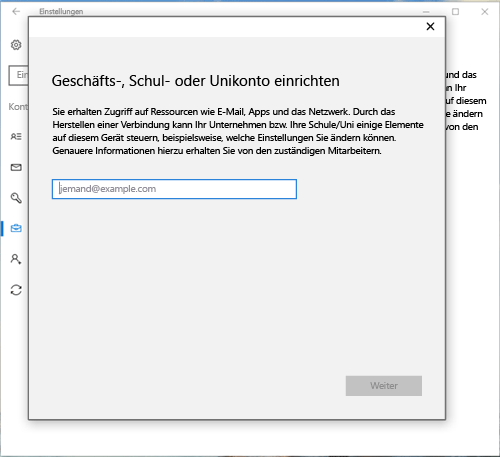
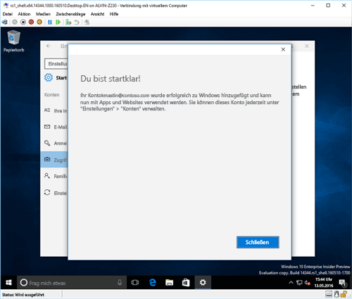

# Registrieren eines Windows 10-Geräts bei Intune

<iframe src="https://channel9.msdn.com/Series/IntuneEnrollment/Windows-Enrollment/player" width="960" height="540" allowFullScreen frameBorder="0"></iframe>

1.  Zum Öffnen der Windows-**Einstellungen** klicken Sie im **Startmenü** auf die Schaltfläche **Einstellungen**. Sie können auch über die Suchleiste nach „Einstellungen“ suchen.

2. Wählen Sie **Konten** > **Zugriff auf Geschäfts-, Schul- oder Unikonto** > **Verbinden** aus.

    

3.  Geben Sie die E-Mail-Adresse Ihres Geschäfts-, Schul- oder Unikontos ein, und wählen Sie **Weiter** aus.

    

4. Melden Sie sich mit Ihrem Geschäfts-, Schul- oder Unikonto bei Intune an.

    

    In einer Meldung wird angezeigt, dass Ihr Unternehmen oder Ihre Bildungseinrichtung das Gerät registriert.

5. Wenn die Seite **Alles bereit!** sehen, wählen Sie **Schließen** aus. Der Vorgang ist abgeschlossen.

  

6. Wenn Sie die Verbindung noch einmal überprüfen möchten, kehren Sie zu den **Einstellungen** zurück. Ihr Geschäfts-, Schul- oder Unikonto wird jetzt aufgeführt.

    

Wenn Sie die obigen Schritte ausgeführt haben und trotzdem nicht auf E-Mails und Dateien Ihres Geschäfts-, Schul- oder Unikontos zugreifen können, befolgen Sie die Schritte unter [Schritte zur Problembehandlung bei Anzeige von „Zugriff auf Geschäfts-, Schul- oder Unikonto“](troubleshoot-your-windows-10-device-windows.md#troubleshooting-steps-to-follow-if-you-see-access-work-or-school).

