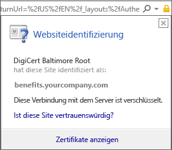
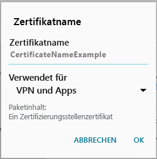

# Auf Ihrem Android-Gerät fehlt ein Zertifikat, das von Ihrem IT-Administrator als erforderlich festgelegt wurde.

Wenn Ihr Gerät nicht bei Intune registriert ist und ein bestimmtes Zertifikat fehlt, das vom IT-Administrator als erforderlich festgelegt wurde, können Sie sich nicht bei der Unternehmensportal-App anmelden. Wenn Sie versuchen, sich anzumelden, sehen Sie die folgende Meldung:

Um dieses Problem zu lösen und das erforderliche Zertifikat zu erhalten, müssen Sie zwei Hauptschritte ausführen:

- Identifizieren Sie das fehlende Zertifikat in einem Unternehmens oder Schul-PC.
- Laden Sie das fehlende Zertifikat mit Ihrem Gerät aus dem Internet herunter.

## Identifizieren des fehlenden Zertifikats durch Suche auf einem Unternehmens oder Schul-PC

1. Öffnen Sie auf einem PC den Internet Explorer. Wenn Ihnen kein PC für diesen Zweck zur Verfügung steht, wenden Sie sich an Ihren IT-Administrator. Die Kontaktinformationen Ihres IT-Administrators finden Sie auf der [Unternehmensportal-Website](http://portal.manage.microsoft.com).

2. Öffnen Sie die [Unternehmensportal-Website](http://portal.manage.microsoft.com), und melden Sie sich mit Ihren Geschäfts- oder Schulanmeldeinformationen an.

3. Wählen Sie ganz rechts in der Adressleiste des Browsers das Symbol aus, das wie ein Vorhängeschloss aussieht, wie im nachstehenden Screenshot dargestellt.

    

    Wenn das Vorhängeschlosssymbol nicht angezeigt wird, beenden Sie den Vorgang, und wenden Sie sich an Ihren IT-Administrator. Das Vorhängeschlosssymbol bedeutet, dass Sie sicher angemeldet sind, Sie sollten also nicht fortfahren, solange dieses Symbol nicht angezeigt wird.

4. Wählen Sie **Zertifikate anzeigen** aus.

    

5. Wählen Sie im Dialogfeld **Zertifikat** die Registerkarte **Zertifizierungspfad** aus, und identifizieren Sie das Zertifikat, das Sie aus dem Internet abrufen müssen. Der Name des Zertifikats, das Sie benötigen, befindet sich an der gleichen Position wie der, der im vorherigen Beispielscreenshot hervorgehoben ist.

## Herunterladen des fehlenden Zertifikats auf das Android-Gerät und Installation

1. Suchen Sie mithilfe einer Suchmaschine wie Bing oder Google nach dem Namen des fehlenden Zertifikats, das Sie im vorherigen Abschnitt angegeben haben. Das Zertifikat kann mit verschiedenen Erweiterungen wie CRT oder PEM usw. enden.

2. Laden Sie das Stammzertifikat von der Website herunter.

3. Ziehen Sie nach dem Herunterladen des Zertifikats vom oberen Rand Ihres Geräts nach unten, um Ihre Benachrichtigungen zu öffnen, und tippen Sie dann in der Liste der Benachrichtigungen auf den Namen des Zertifikats.

4. Übernehmen Sie im Dialogfeld **Name the Certificate** (Zertifikat benennen), das im folgenden Screenshot angezeigt wird, den Standardzertifikatnamen.

5. Stellen Sie sicher, dass **Verwendung von Anmeldeinformationen** auf **Für VPN und Apps** festgelegt ist, und tippen Sie dann auf **OK**.

    

6. Schließen Sie die Unternehmensportal-App.

7. Öffnen Sie die Unternehmensportal-App erneut. Sie sollten sich jetzt bei der Unternehmensportal-App anmelden können. Wenn Sie Hilfe benötigen, wenden Sie sich an Ihren IT-Administrator.

Wenn die gleiche „Zertifikat fehlt“-Nachricht wie oben gezeigt angezeigt wird, und Sie den Vorgang oben bereits ausgeführt haben, benötigt Ihr IT-Administrator wahrscheinlich noch ein anderes Zertifikat, um Ihnen bei der Installation zu helfen. Verwenden Sie die Kontaktinformationen auf der [Unternehmensportal-Website](http://portal.manage.microsoft.com), um sich an Ihren IT-Administrator zu wenden.

